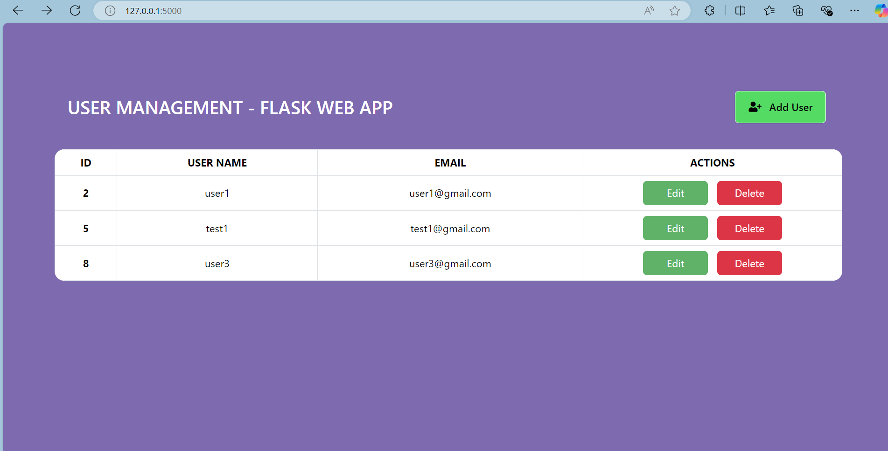

## Description
This repository contains the guide to a user management system using **Flask**, **SQLAlchemy** and **XAMPP**.

### Installation guide

After creating a folder `usermanagement` 

- Create a virtual environment: __`python -m venv env1`__

>Note: creating a virtual environment is important as it isolates your project's dependencies from the global python configurations.

- Activate the virtual environment: __`env1\Scripts\activate`__

- Install Flask __`pip install flask`__

Install the following modules:
- flask-restful
- flask-SQLAlchemy
- flask-Migrate

__`pip install flask-restful flask SQLAlchemy flask-Migrate`__

Installing __XAMPP__: [Download xampp](`https://www.apachefriends.org/download.html`)
Go to the website and download the version compatible with your system.

>Note: XAMPP includes:
>- apache(web server) 
>- mysql (database)
>- phpMyAdmin (database management interface)

### Starting XAMPP

Once the installation is complete open the **Xampp Control Panel**.

Click Start (under Actions) for **Apache** and **MySQL** module only.

If sucessfully started the modules will be highlighted with **green** color.

##### **ERROR**
If you encounter the following error from MySQL

Open cmd and run `netstat -ano | findstr :3306`

This will show if something in your system is already using the port __3306__, In the last column of output you can see the **PID**.

Open __task manager__ and go to the __details__ tab, find the __process id (PID)__, right click on the task and click on __end process__.

Try restarting MySQL again, this is resolve the issue.

#### Creating a database

Go to [localhost phpmyadmin](`http://localhost/phpmyadmin/`) and create a database name `usermanagement`.

#### Run the project

Open the terminal in the working directory.

Run the following commands

- `flask db init` : to initialize the migration folder
- `flask db migrate` : creates migration script
- `flask db upgrade` : applies migration to the database

Navigate to `app.py` and click on the `Run` button on top right corner of your __vscode__ editor.

It will start your application at: __`http://127.0.0.1:5000`__

### Screenshots of the application

1. **Home Page**

2. **Add User Page**

3. **Edit user page**

p

4. **Delete user confirmation dialog**

5. **After clicking _OK_ to delete**

#### Link

This is a reference from the [youtube tutorial](https://www.youtube.com/playlist?list=PLXpWu84ZnHT-e-f6d_r6Q21cTsGAS4xXX) by EazyPractiz.
